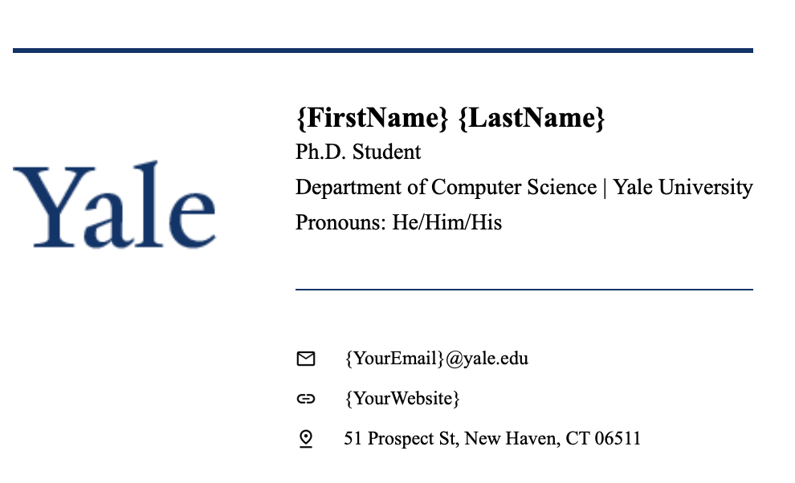

# Yale-Email-Signature
Email signature for Yalies

## Preview

## How to Use

- Clone the repo
- Open the HTML file with ur TEXT EDITOR
- Change {Yourxxx} to your name/department/pronouns/email/website/address
- Open the HTML file with ur BROWSER
- This is a preview, try clicking the links and make sure they work as desired
- In the broswer preview, Ctrl+A / Cmd+A to select all
- Copy-paste the things into your email clients (search online for How to add signature to my Gmail on IPhone)

